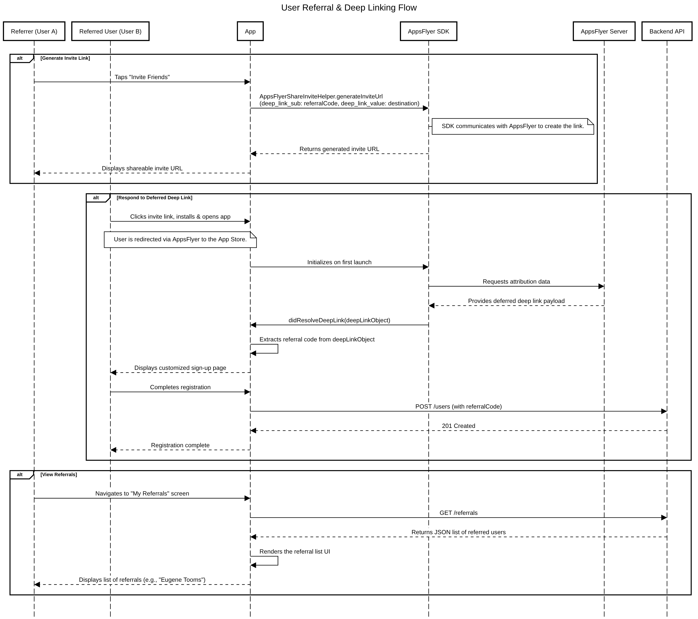
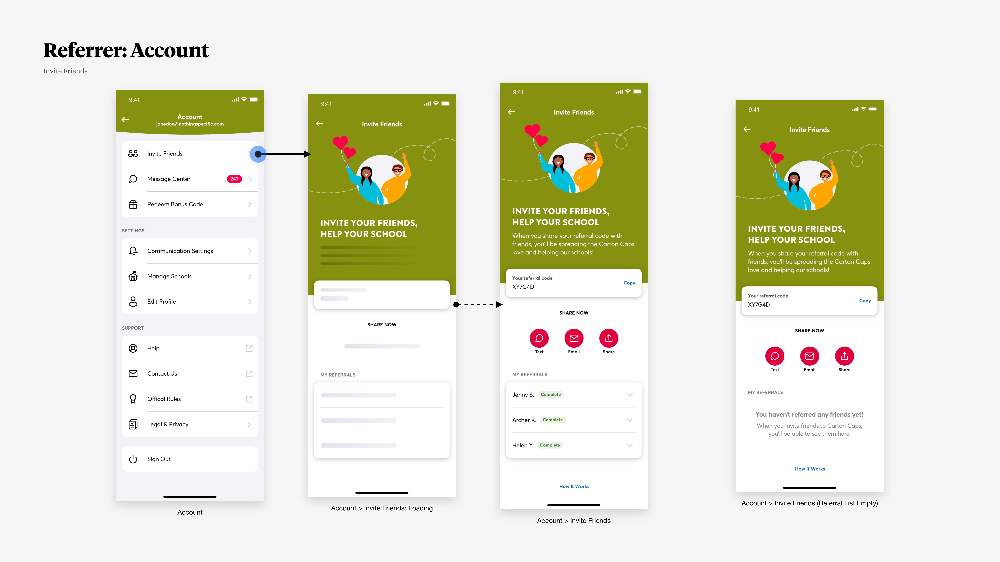
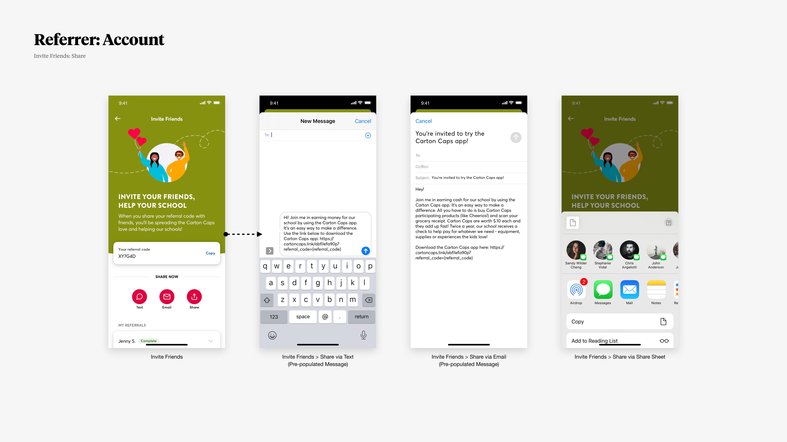
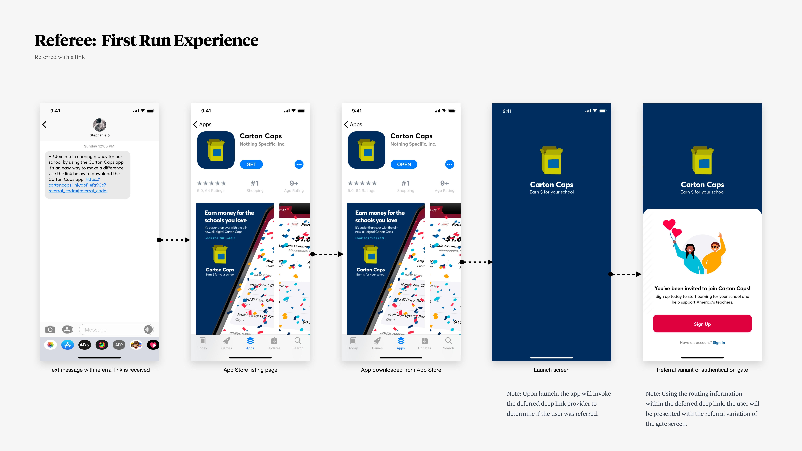
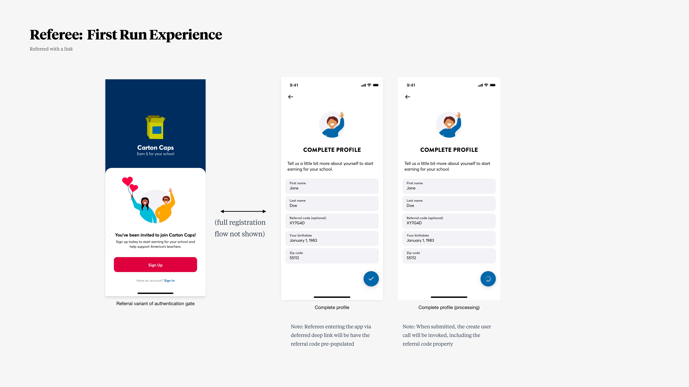

# Deferred Deep Linking

This document describes how Carton Caps uses AppsFlyer's Deferred Deep Linking SDK to implement a referral system where users can invite their friends to install the Carton Caps app, and view a list of the friends they've invited. 

## AppsFlyer

The brief didn't specify which third-party vendor we'll be using for deferred deep linking, so we'll assume that we're using [AppsFlyer's iOS Unified Deep Linking SDK](https://dev.appsflyer.com/hc/docs/dl_ios_unified_deep_linking).

This drives our design, and understanding how AppsFlyer's SDK integrates into a mobile app helps us understand how our referral API should work.

## Overview



## Generating Invite Links





The app uses [`AppsFlyerShareInviteHelper.generateInviteUrl`](https://dev.appsflyer.com/hc/docs/dl_ios_user_invite#set-up-invite-link-generation) to generate invite URLs. These are "deferred deep links" that redirect to AppsFlyer's website, which then forwards users to the App Store.

When generating an invite URL, the user's referral code is included through one of the `deep_link_sub[1-10]` parameters. These parameters are passed to the referred user's first app launch.

The `deep_link_value` parameter controls where in the app the referred user lands after opening it.

## Handling Deferred Deep Links





The app handles deferred deep links by implementing [`didResolveDeepLink`](https://dev.appsflyer.com/hc/docs/ios-sdk-reference-appsflyerdeeplinkdelegate#didresolvedeeplink). The referral code is extracted from the [`AppsFlyerDeepLink`](https://dev.appsflyer.com/hc/docs/ios-sdk-reference-appsflyerdeeplink) object.

This allows us to display a customized sign-up page. The key requirement is passing the referral code to the API when the new user completes registration.

## Viewing Referrals

Users can view a list of people they've referred through the new `GET /users/:user_id/referrals` API endpoint.

This endpoint returns the data needed to render the referrals UI.

```json
[
    {
        "id": 5,
        "user": {
            "id": 6,
            "name": "Eugene Victor Tooms",
            "avatar_url": "https://place-hold.it/64x64"
        },
        "status": "complete",
        "created_at": "2025-08-10T20:03:00.123456"
    }
]
```

## Preventing Abuse

Rewarding users for inviting their friends incentives abuse.

The most obvious defense is to require new users to perform a key action (e.g., complete a purchase) before the referral is marked "complete." Until this condition is met, a referral will have a "pending" status.

Other fraud detection strategies include using various signals to identify when a user is inviting themselves. Examples include:

* Limit the number of referrals a user can make in a given time period.
* Correlating device identifiers, IP addresses, etc.
* Analyzing server logs for suspicious activity.
* Flagging accounts that use similar email addresses or payment information.
